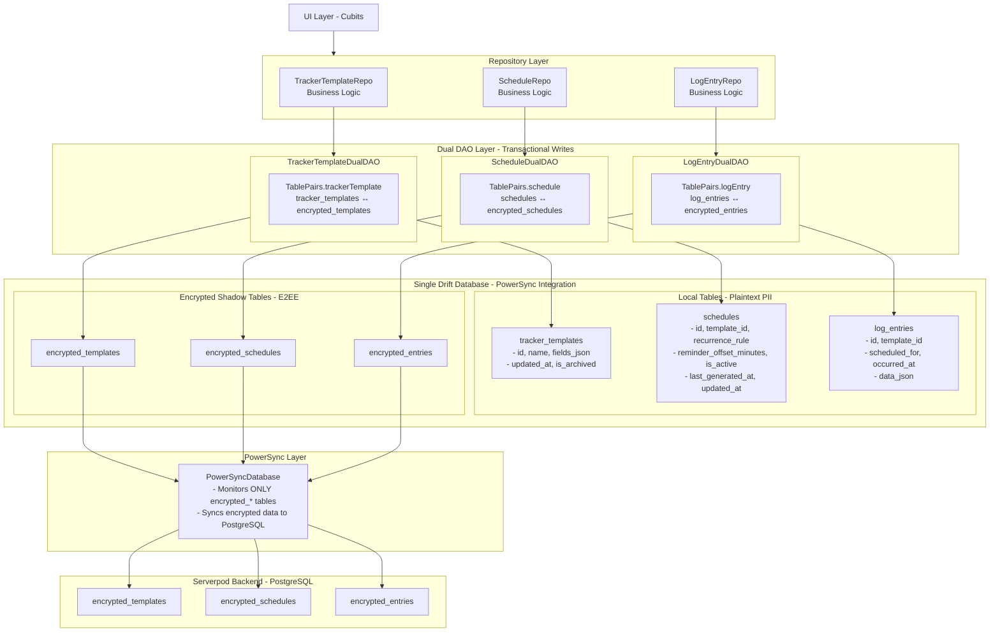

# PII-Less Architecture with E2EE Dual DAO + Stream-Based Puller

## Data Model Overview

```
TrackerTemplateModel  →  "WHAT" (the form structure)
ScheduleModel         →  "WHEN" (the reminder rules)
LogEntryModel         →  "ACTUAL" (the recorded data)
```

## Complete Data Flow Diagram



## Table Pairs

| Model | Local Table | Encrypted Table | TablePair |
|-------|-------------|-----------------|-----------|
| TrackerTemplateModel | tracker_templates | encrypted_templates | `TablePairs.trackerTemplate(db)` |
| ScheduleModel | schedules | encrypted_schedules | `TablePairs.schedule(db)` |
| LogEntryModel | log_entries | encrypted_entries | `TablePairs.logEntry(db)` |

## Key Architecture Components

### 1. **Dual DAO Layer (Outgoing)**
- **Purpose**: App writes with encryption
- **Pattern**: Transactional writes to both local + encrypted tables
- **Type Safety**: TablePair pattern prevents table mix-ups
- **Flow**: `App → Repository → DualDAO → [Local + Encrypted] → PowerSync`

### 2. **E2EE Puller (Incoming)**
- **Purpose**: PowerSync sync with decryption
- **Pattern**: Stream-based listeners with type-safe processors
- **Type Safety**: Same TablePair pattern as Dual DAO
- **Flow**: `PowerSync → Encrypted → Drift Streams → Processors → Local`

### 3. **Data Flow Directions**
```
OUTGOING (App Writes):
App → DualDAO → Local + Encrypted → PowerSync → Backend

INCOMING (Sync Receives):
Backend → PowerSync → Encrypted → E2EE Puller → Local
```

### 4. **PII Protection Guarantees**
- ✅ **Local tables**: Never synced, PII stays on device
- ✅ **Encrypted tables**: Only encrypted blobs sync to backend
- ✅ **PowerSync**: No access to plaintext data
- ✅ **Backend**: Only receives encrypted data, zero PII exposure

### 5. **Type Safety Benefits**
- ✅ **Compile-time pairing**: TablePairs prevent wrong table combinations
- ✅ **No mix-ups**: TrackerTemplate, Schedule, and LogEntry processors isolated
- ✅ **Consistent patterns**: Same TablePair used in both Dual DAO and E2EE Puller
- ✅ **Extensible**: Easy to add new table pairs with same safety guarantees
