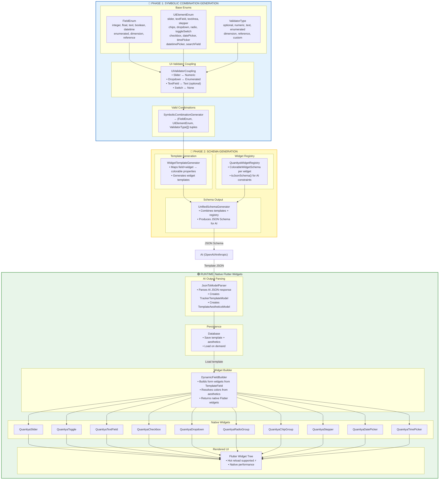
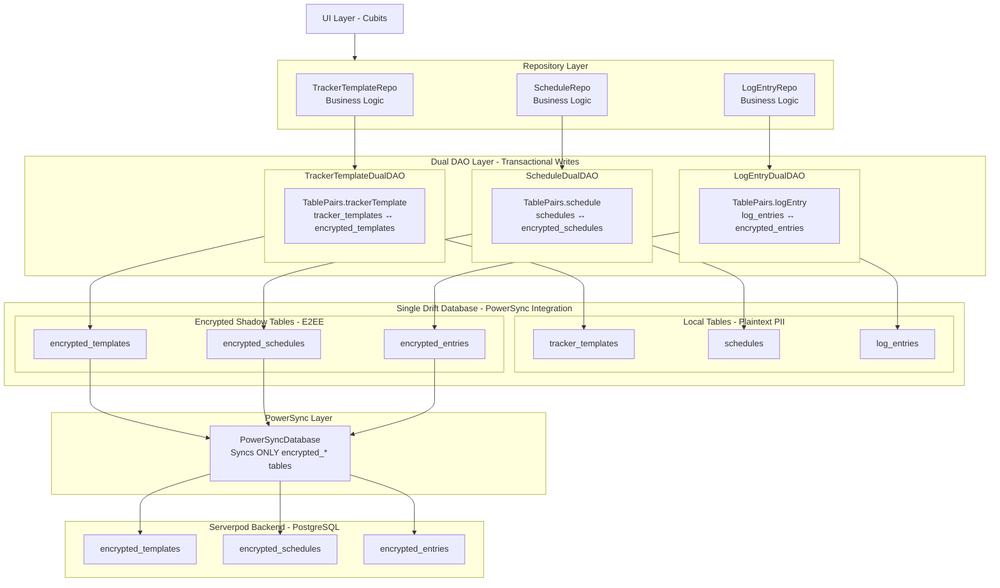

# Quanitya Architecture Documentation

## Overview

Quanitya is a privacy-first personal tracking app built with Flutter. It uses end-to-end encryption (E2EE) to ensure user data never leaves the device in plaintext.

## Core Architecture Diagrams

### Template Generation Pipeline



### Data Flow (PII-Less E2EE)



## Key Components

| Layer | Component | Location | Purpose |
|-------|-----------|----------|---------|
| Enums | FieldEnum | `lib/logic/templates/enums/` | Data types |
| Enums | UiElementEnum | `lib/logic/templates/enums/` | Widget types |
| Enums | ValidatorType | `lib/logic/templates/models/shared/` | Validation rules |
| Engine | SymbolicCombinationGenerator | `lib/logic/templates/services/engine/` | Valid combinations |
| Engine | UnifiedSchemaGenerator | `lib/logic/templates/services/engine/` | JSON Schema for AI |
| Widgets | QuanityaWidgetRegistry | `lib/design_system/widgets/quanitya/generatable/` | Widget schemas |
| Widgets | DynamicFieldBuilder | `lib/logic/templates/services/shared/` | Runtime widget builder |
| Data | Dual DAOs | `lib/data/daos/` | E2EE transactional writes |
| State | Cubits | `lib/features/*/cubits/` | UI state management |

## Development Standards

See `.kiro/steering/` for:
- `quanitya_development_standards.md` - Freezed, Drift, Cubits, Injectable patterns
- `cubit_ui_flow_pattern.md` - Automatic UI feedback system
- `flutter_color_palette_guide.md` - Enumerated color system
- `pii-less.md` - E2EE architecture details

## Generating API Documentation

```bash
# Generate dartdoc
dart doc .

# Output will be in doc/api/
```
